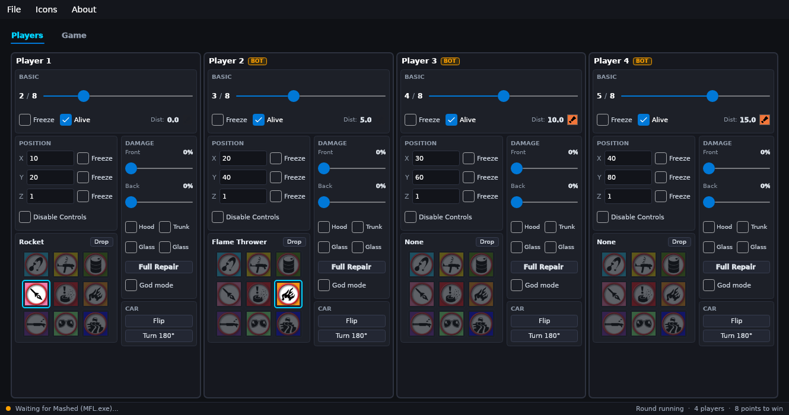
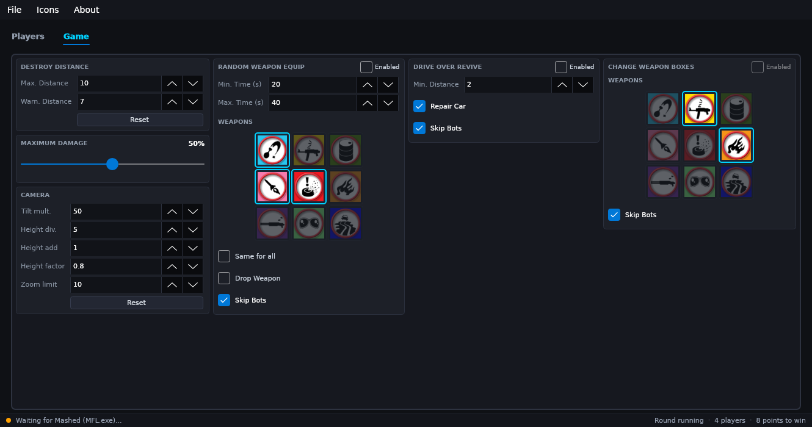

# SciLor's Mashed Trainer v0.2.0

Modern, cross-platform trainer for the PC game **Mashed: Fully Loaded**. Re-engineered on .NET 8 and Avalonia UI with automated headless GUI testing, simulation support, and dual distribution profiles.

---

## Screenshots

### Players Tab


### Game Tab


---

## Downloads & Requirements

The trainer is distributed in two builds on each release:

1. **Standalone (Zero Prerequisites)**: Self-contained single executable (`MashedTrainer-Standalone-win-x86.zip`). Requires no .NET runtime installed.
2. **Tiny (Framework-Dependent)**: Ultra-compact build (~3 MB) (`MashedTrainer-Tiny-win-x86.zip`). Requires the [.NET 8 Desktop Runtime (x86)](https://dotnet.microsoft.com/download/dotnet/8.0).

> **Note**: I recommend using [DXWnd](https://sourceforge.net/projects/dxwnd/) to run Mashed in windowed mode alongside the trainer.

---

## Features

### General
- **Icon Packs**: Switch weapon icons between the in-game look (default) and the classic set via the *Icons* menu
- **Status Bar**: Shows connection state and tells you when memory writes fail (run the trainer as administrator in that case); controls stay disabled until Mashed is found

### Player (Per-Player Controls for P1–P4)
- **Score**: Change and freeze points
- **Revive**: Instant respawn and revive toggle
- **Teleport & Freeze**: View and set coordinates (X, Y, Z) and freeze axes individually
- **Controls**: Disable/enable player vehicle controls
- **Weapons**: Equip any of the 9 weapons instantly, or drop active weapon
- **Damage**: Adjust front and back damage sliders, toggle individual damage parts (Hood, Trunk, Glass), and 1-click Full Repair
- **Car Physics**: 1-click **Flip** (rights an upside-down car) and **Turn 180°**
- **God Mode**: Option in the Damage block that keeps the car fully repaired while alive
- **Bot Badge**: Bot-controlled players are marked with a BOT tag

### Game & Camera
- **Destroy Distance**: Customize warning threshold and maximum elimination distance
- **Maximum Damage**: Set maximum damage cap (normally 50%)
- **Camera Tuning**: Adjust camera tilt multiplier, height distance divider, height add, height distance factor, and zoom limit

### Fun Modifiers
- **Random Weapon Equip**: Periodically equips randomized weapons for all players or bots
- **Drive-Over Revive**: Drive over eliminated opponents to bring them back into the race, automatically flipping cars on their roof

---

## Building & Testing

### Requirements
- [.NET 8 SDK](https://dotnet.microsoft.com/download/dotnet/8.0)

### Building
```bash
# Build trainer
dotnet build MashedTrainer.sln -c Release

# Run automated tests and capture headless GUI screenshots
dotnet test MashedTrainer.sln -c Release
```

### Developing on Linux
The trainer features a built-in memory target simulator (`MockMemoryTarget`) that automatically activates when running outside Windows without the game process. You can fully develop, test, and render the GUI headlessly on Linux without needing Windows or the actual game executable.

---

## ChangeLog

### v0.2.1 (unreleased)
- **Icon Packs**: New *Icons* menu with in-game (default) and classic weapon icons.
- **God Mode**: Option in the Damage block that keeps the car fully repaired while alive
- **Bot Badge**: Bot players are marked in the Players tab.
- **Layout**: Basic block spans the full player card; round state, player count and points to win moved into the status bar; larger weapon grids.
- **Numeric Inputs**: Game tab values use validated numeric spinners with limits.
- **Status Feedback**: Controls are disabled until Mashed is attached; failed memory writes and multiple MFL.exe instances are reported in the status bar.
- **Fixes**: Fixed a PropertyChanged handler leak on reconnect; process detection now polls once per second while detached.
- **Simulator**: *About > Toggle Mock Game Mode* switches the built-in simulator on and off (on by default outside Windows).

### v0.2.0 (2026-10-07)
- **Platform Migration**: Completely modernized from .NET Framework 4.5 / WPF to .NET 8 / Avalonia UI.
- **Cross-Platform Development**: Native Linux building and testing support with headless screenshot generation.
- **Dual Distribution**: Available as both a lightweight framework-dependent build and a zero-dependency standalone single-file binary.
- **UI Redesign**: Dark tactical combat HUD theme matching the style of *Mashed: Drive to Survive*, featuring 1:1 square weapon loadout grids and high-visibility combat selection rings.
- **Dedicated Game Tab**: Separated global game, camera, and modifier controls into their own dedicated tab.
- **New Controls**: Added "Flip" and "Turn 180°" vehicle righting actions, camera "Height factor" and "Zoom limit" controls.
- **Bug Fixes**:
  - Fixed vehicle coordinate setting by synchronizing both game matrix buffers.
  - Patching logic now targets specific instructions rather than shared global constants, eliminating AI/physics side-effects.
  - Fixed typo in `ChangeWeapon.asm` target address (`0x467E6` -> `0x467E60`).
- **CI/CD**: Added GitHub Actions workflows for continuous build, test, and automated tag-based releases.

### v0.1.0 (2017-11-20)
- Initial Release

---

## Author & Support

- **Author**: SciLor
- **Website**: [scilor.com](http://www.scilor.com/)
- **Companion Tool**: [Mashed and Mashed Fully Loaded Runner](https://github.com/mashed-reverse-engineering/MashedRunner)
- **Donate**: If you enjoy this trainer, [donations are warmly appreciated](http://www.scilor.com/donate.html)!
